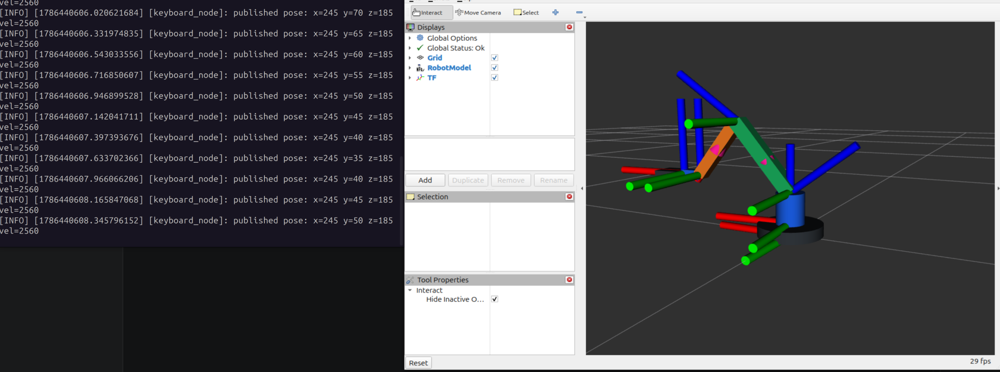

# 基于 ROS2 的采摘机械臂控制仿真

这是一个基于 **ROS2 Jazzy** 的采摘机械臂控制仿真工作空间，用于在没有真实机械臂、相机和点云设备的情况下，复现并理解机械臂控制链路。

项目不是完整迁移本科 ROS1 毕设中的摄像头、点云和真实硬件控制，而是聚焦一个更清晰、更适合学习和展示的最小闭环：

```text
目标坐标输入 -> mock 执行节点 -> 关节状态转换 -> URDF 机械臂模型 -> RViz2 可视化
```

## 运行效果

RViz2 机械臂控制仿真：


ROS2 通信图：


TF/RobotModel 可视化：



## 项目定位

这个仓库主要用于：

- 体验 ROS1 到 ROS2 的开发模式变化。
- 熟悉 ROS2 工作空间、功能包、接口、节点、launch 和 RViz2。
- 将原 ROS1 机械臂项目中的控制思想迁移为 ROS2 最小可运行闭环。
- 形成一个可编译、可运行、可展示的机器人软件学习项目。

当前不做：

- Orbbec 相机驱动迁移。
- PointCloud2/Open3D 点云识别。
- Gazebo 物理仿真。
- MoveIt2 运动规划。
- 真实串口机械臂控制。

## 功能包结构

```text
src/
  armpy_interfaces/     # 自定义 msg/srv 接口
  armpy_description/    # URDF/xacro、RViz2 配置、模型显示 launch
  armpy_sim/            # 键盘控制、mock 执行、joint_states 转换、仿真 launch
```

| Package | Role |
| --- | --- |
| `armpy_interfaces` | 定义 `ArmPose.msg` 和 `ArmPoseRange.srv`，作为控制节点、仿真节点之间的通信协议 |
| `armpy_description` | 定义机械臂 URDF/xacro 模型、RViz2 显示配置和单独模型显示 launch |
| `armpy_sim` | 提供键盘控制、mock 机械臂执行节点、目标坐标到 `/joint_states` 的转换节点和一键启动 launch |

## 仿真链路

完整节点关系：

```text
/keyboard_node
  -> /arm/pose
     -> /mock_arm_node
     -> /pose_to_joint_states_node
          -> /joint_states
             -> /robot_state_publisher
                  -> /tf
                     -> /rviz2
```

说明：

- `keyboard_node` 发布目标坐标。
- `mock_arm_node` 订阅目标坐标，模拟真实机械臂执行节点。
- `pose_to_joint_states_node` 将目标坐标近似转换为机械臂关节角。
- `robot_state_publisher` 根据 URDF 和 `/joint_states` 发布 TF。
- RViz2 读取机器人模型和 TF，显示机械臂姿态变化。

## 环境

推荐环境：

- Ubuntu 24.04
- ROS2 Jazzy
- Python 3.12
- RViz2

安装常用依赖：

```bash
sudo apt update
sudo apt install ros-jazzy-desktop python3-colcon-common-extensions ros-dev-tools
```

## 快速开始

编译：

```bash
cd ~/armpy-ros2-ws
source /opt/ros/jazzy/setup.bash
colcon build --symlink-install
source install/setup.bash
```

推荐用两个终端启动。

终端 1：启动仿真节点、`robot_state_publisher` 和 RViz2。

```bash
cd ~/armpy-ros2-ws
source /opt/ros/jazzy/setup.bash
source install/setup.bash
ros2 launch armpy_sim keyboard_rviz.launch.py
```

终端 2：启动键盘控制节点。

```bash
cd ~/armpy-ros2-ws
source /opt/ros/jazzy/setup.bash
source install/setup.bash
ros2 run armpy_sim keyboard_node
```

如果明确希望 launch 同时启动键盘节点：

```bash
ros2 launch armpy_sim keyboard_rviz.launch.py start_keyboard:=true
```

交互式键盘节点更推荐单独终端运行。

## 键盘控制

| Key | Effect |
| --- | --- |
| `W/S` | increase/decrease x |
| `Q/E` | increase/decrease y |
| `A/D` | increase/decrease z |
| `C` | quit |

## 常用检查命令

查看节点：

```bash
ros2 node list
```

查看 topic：

```bash
ros2 topic list
```

检查目标坐标 topic：

```bash
ros2 topic info /arm/pose --verbose
ros2 topic echo /arm/pose
```

检查关节状态：

```bash
ros2 topic info /joint_states --verbose
ros2 topic echo /joint_states
```

检查运动范围服务：

```bash
ros2 service call /arm/pose/range armpy_interfaces/srv/ArmPoseRange "{x: 220, y: 80, z: 180}"
```

## ROS1 与 ROS2 对比

这个项目对应原 ROS1 仿真链路，但开发模式有明显变化：

| Aspect | ROS1 | ROS2 |
| --- | --- | --- |
| Master | 需要 `roscore` | 不需要 `roscore`，基于 DDS 自动发现 |
| Build | `catkin_make` | `colcon build` |
| Python client | `rospy` | `rclpy` |
| Launch | XML launch | Python launch |
| Interface generation | `message_generation` | `rosidl_default_generators` |
| Visualization | RViz | RViz2 |

仿真核心概念基本延续：

```text
URDF/xacro + /joint_states + robot_state_publisher + TF + RViz2
```

## 代码管理

不要提交 ROS2 编译产物：

```text
build/
install/
log/
```

这些目录已由 `.gitignore` 忽略。`.gitattributes` 用于统一 ROS/Python/launch 文件的 LF 换行，避免 Windows 和 Ubuntu 之间同步时出现脚本换行问题。

