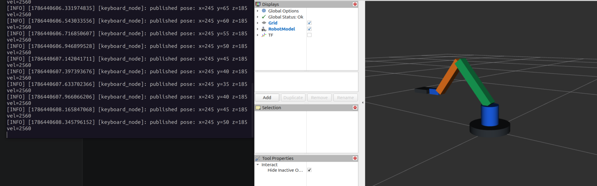
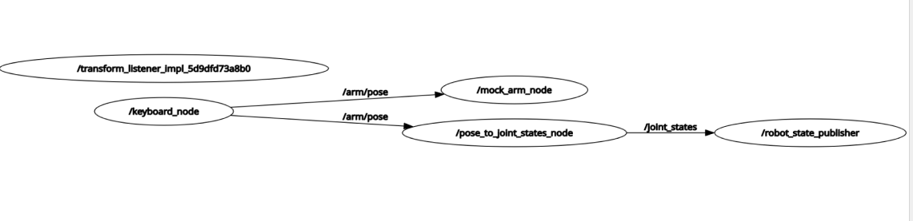

# 基于 ROS2 的仿真机械臂控制系统

这是一个基于 **ROS2 Jazzy** 的机械臂控制可视化项目，用于在无实体硬件条件下验证一条最小控制链路：

```text
键盘目标输入 -> 仿真执行节点 -> 关节状态发布 -> URDF 机械臂模型 -> RViz2 可视化
```

项目当前聚焦 ROS2 基础开发、节点通信、自定义接口、URDF/xacro 建模、`/joint_states` 发布、TF 发布与 RViz2 可视化验证。它不是物理级仿真项目，暂不包含 Gazebo、MoveIt2、ros2_control 或真实设备控制。

## 运行效果

RViz2 机械臂可视化：



ROS2 通信图：



## 功能包结构

```text
src/
  armpy_interfaces/     # 自定义 msg/srv 接口
  armpy_description/    # URDF/xacro、RViz2 配置、模型显示 launch
  armpy_sim/            # 键盘控制、仿真执行、joint_states 转换、系统 launch
```

| Package | Role |
| --- | --- |
| `armpy_interfaces` | 定义 `ArmPose.msg` 和 `ArmPoseRange.srv`，作为节点间通信协议 |
| `armpy_description` | 定义机械臂 URDF/xacro 模型、RViz2 显示配置和模型显示入口 |
| `armpy_sim` | 提供键盘输入节点、仿真执行节点、目标坐标到 `/joint_states` 的转换节点和一键启动入口 |

## 系统链路

```text
/keyboard_node
  -> /arm/pose
     -> /mock_arm_node
     -> /pose_to_joint_states_node
          -> /joint_states
             -> /robot_state_publisher
                  -> /tf
                     -> /rviz2
```

说明：

- `keyboard_node` 发布目标坐标。
- `mock_arm_node` 订阅目标坐标，并提供目标范围检查服务。
- `pose_to_joint_states_node` 将目标坐标近似转换为机械臂关节状态。
- `robot_state_publisher` 根据 URDF 和 `/joint_states` 发布 TF。
- RViz2 读取机器人模型和 TF，显示机械臂姿态变化。

## 环境

推荐环境：

- Ubuntu 24.04
- ROS2 Jazzy
- Python 3.12
- RViz2

常用依赖：

```bash
sudo apt update
sudo apt install ros-jazzy-desktop python3-colcon-common-extensions ros-dev-tools
```

## 快速开始

编译：

```bash
cd ~/armpy-ros2-ws
source /opt/ros/jazzy/setup.bash
colcon build --symlink-install
source install/setup.bash
```

推荐用两个终端启动。

终端 1：启动仿真节点、`robot_state_publisher` 和 RViz2。

```bash
cd ~/armpy-ros2-ws
source /opt/ros/jazzy/setup.bash
source install/setup.bash
ros2 launch armpy_sim keyboard_rviz.launch.py
```

终端 2：启动键盘控制节点。

```bash
cd ~/armpy-ros2-ws
source /opt/ros/jazzy/setup.bash
source install/setup.bash
ros2 run armpy_sim keyboard_node
```

如果希望 launch 同时启动键盘节点：

```bash
ros2 launch armpy_sim keyboard_rviz.launch.py start_keyboard:=true
```

交互式键盘节点更推荐单独终端运行，便于接收键盘输入。

## 键盘控制

| Key | Effect |
| --- | --- |
| `W/S` | increase/decrease x |
| `Q/E` | increase/decrease y |
| `A/D` | increase/decrease z |
| `C` | quit |

## 常用检查命令

查看节点：

```bash
ros2 node list
```

查看 topic：

```bash
ros2 topic list
```

检查目标坐标 topic：

```bash
ros2 topic info /arm/pose --verbose
ros2 topic echo /arm/pose
```

检查关节状态：

```bash
ros2 topic info /joint_states --verbose
ros2 topic echo /joint_states
```

检查目标范围服务：

```bash
ros2 service call /arm/pose/range armpy_interfaces/srv/ArmPoseRange "{x: 220, y: 80, z: 180}"
```

## 当前边界

当前已经实现：

- ROS2 Jazzy 工作空间。
- 自定义 msg/srv。
- rclpy topic/service 节点。
- URDF/xacro 机械臂模型。
- `/joint_states` 与 `robot_state_publisher` 可视化链路。
- RViz2 机械臂控制流程可视化验证。

当前暂不包含：

- Gazebo 物理仿真。
- MoveIt2 运动规划。
- ros2_control 控制器链路。
- 视觉感知或点云处理。
- 实体硬件驱动。

## 代码管理

不要提交 ROS2 编译产物：

```text
build/
install/
log/
```

这些目录已由 `.gitignore` 忽略。`.gitattributes` 用于统一 ROS、Python、launch 文件的 LF 换行，减少跨平台同步时的脚本换行问题。
